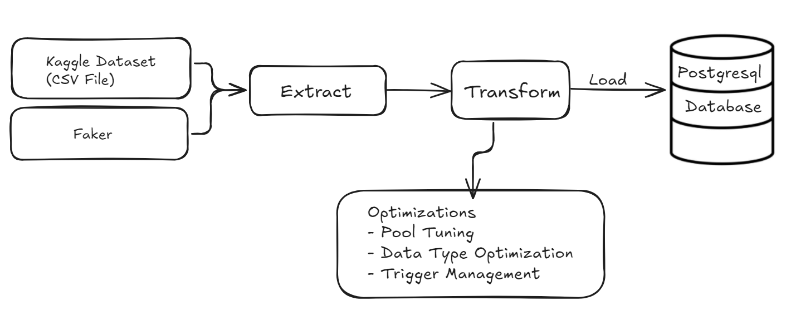

# ecommerce-data-engineering
## Table of Contents
1. [Project Overview](#project-overview)
2. [Technology Stack](#technology-stack)
3. [Database Schema](#database-schema)
4. [ETL Diagram](#etl-diagram)
5. [ETL Process](#etl-process)
6. [Installation](#installation)
7. [Usage](#usage)
8. [Optimizations](#optimizations)
9. [Sample Data](#sample-data)
10. [Project Structure](#project-structure)
11. [Contributing](#contributing)
12. [License](#license)
---

## Project Overview

This project demonstrates the creation of a **data engineering pipeline** using **PostgreSQL** as the relational database and **Python** (Faker Library) to generate synthetic data. The pipeline follows the **ETL (Extract, Transform, Load)** process, and includes optimizations such as **data type optimization**, **pool tuning**, and **trigger management** to ensure efficient data processing.
This repository contains the ETL pipeline for the eCommerce project, designed to process and load data into the database schema from another repository: [eCommerce Database Design](https://github.com/SpongeBall-GumPants/E-Commerce-Database-System).

---

## Technology Stack

- **PostgreSQL**: Relational database used to store data.
    
- **Python 3.x**: Programming language used for ETL.
    
    - **Faker**: Python library used to generate synthetic data.
        
    - **Psycopg2**: Python library for interacting with PostgreSQL.
        
- **SQL**: Used for creating the database schema, queries, and optimization steps.
    
- **ETL Process**: Data creation, transformation, and loading.
    

---

## Database Schema
  
  

---
## ETL Diagram
  
## ETL Process
1. **Generate**: Synthetic data is generated using the **Faker** library in Python for tables.
2. **Extract**: 
   - Data is extracted from the Kaggle dataset (in CSV format) using **Pandas**. 
   - The dataset is read, cleaned, and processed for insertion into the PostgreSQL database.
3. **Transform**: 
   - Data is transformed for consistency and formatting, such as ensuring the correct data types for `score`, `email`, `address`, and `name`. Missing values are handled (e.g., filling with random values for `score`)
   - **Data Type Conversion**: Columns like `score` are converted to the correct data type, and  missing values are filled with synthetic or default values.
4. **Load**: 
   - The transformed data is loaded into PostgreSQL.
   - For Kaggle CSV data, it is loaded into corresponding tables (`Products`, `Shops`).
   - Data insertion is done using **batch processing** by using the `to_sql` function from pandas, and optimizations like **disabling triggers** and **batch processing** are applied to ensure efficient data loading.
---

## Installation

1. Clone the repository:
    
    `git clone https://github.com/yourusername/data-engineering-pipeline.git cd data-engineering-pipeline`
    
2. Set up PostgreSQL Database:
    
	- Create a PostgreSQL database:    
        `createdb data_pipeline_db`
        
    - Update the database connection settings in `config.py`.

---

## Usage

1. Run the ETL script:
    
    `python main.py`
---

## Optimizations

- **Data Type Optimization**: Optimized data types for efficient storage in PostgreSQL.
    
- **Trigger Management**: Disabled triggers during the data load process for faster performance.
    
- **Pooling**: Used connection pooling to manage database connections efficiently.

| Optimization Step           | Total Load Time (s) | Improvement from Base |
| --------------------------- | ------------------- | --------------------- |
| **Base (No Optimizations)** | 10.46s              | —                     |
| **+ Pool Tuning**           | 10.08s              | -0.38s (-3.6%)        |
| **+ Trigger Disabled**      | 6.60s               | -3.86s (-36.9%)       |
| **+ Optimal Data Types**    | 6.33s               | -0.27s (-4.1%)        |

---

### **Key Takeaways:**

## Sample Data

- **Customer**

| "id"        | "name"      | "minit" | "lname"   | "country"                  | "points" | "phone"       | "bdate"      | "sex" |
|-------------|-------------|---------|-----------|----------------------------|----------|---------------|--------------|-------|
| "CUST00000" | "Alejandro" | "S"     | "Foster"  | "Turks and Caicos Islands" | 2957     | "92681344848" | "1984-05-14" | "M"   |
| "CUST00001" | "Edward"    | "N"     | "Bryant"  | "Rwanda"                   | 9638     | "52077597082" | "2006-11-21" | "F"   |
| "CUST00002" | "John"      | "W"     | "Freeman" | "Greenland"                | 5533     | "65012340323" | "1992-08-19" | "F"   |

- **Product**

| "id"        | "name"                         | "tr_flag" | "brand"  |   |
|-------------|--------------------------------|-----------|----------|---|
| "1003461"   | "Product of xiaomi at $489.07" | false     | "xiaomi" |   |
| "5000088"   | "Product of janome at $293.65" | false     | "janome" |   |
| "17302664 " | "Product of creed at $28.31"   | false     | "creed"  |   |

- **Shop**

| "id"        | "name"        | "email"                 | "address"                                            | "country" | "woman_ent_flag" | "score" |
|-------------|---------------|-------------------------|------------------------------------------------------|-----------|------------------|---------|
| "SHOP0000 " | "Shields Ltd" | "hhill@guerra.com"      | "027 Beth Junction Suite 620, Simmonsfurt, WY 16383" | "Rwanda"  | false            | 4.3     |
| "SHOP0001 " | "Hawkins PLC" | "christian67@yang.org"  | "29931 Christopher Spur, Stephensville, NV 26874"    | "Burundi" | false            | 0.7     |
| "SHOP0002 " | "Hayden Inc"  | "james09@hernandez.net" | "1014 Shane Oval Suite 037, Lake Valerie, KY 68027"  | "Jordan"  | false            | 2.0     |

- **Orders**

| u_id      | log_id   | sp_id    | sp_shop_id | order_id | status    | date       | address                                                  | payer_id  | pay_id   | pay_amount | refer_id | coupon   | amount |
| --------- | -------- | -------- | ---------- | -------- | --------- | ---------- | -------------------------------------------------------- | --------- | -------- | ---------- | -------- | -------- | ------ |
| CUST01635 | LOGI3453 | 32402125 | SHOP4109   | ORD00000 | refunded  | 2025-03-11 | 543 Ferrell Lake Apt. 390, West Sandra, PW 20701         | CUST01635 | PAY01635 | 448        |          |          | 5      |
| CUST03519 | LOGI0536 | 1005066  | SHOP3673   | ORD00001 | cancelled | 2025-01-26 | 4947 Jones Corner Suite 049, Thomaschester, WI 52945     | CUST03519 | PAY03519 | 213        |          |          | 4      |
| CUST02066 | LOGI4785 | 1307402  | SHOP1139   | ORD00002 | refunded  | 2025-03-30 | 47355 Philip Lake Suite 144, Lake Jeffreyshire, AS 68769 | CUST02066 | PAY02066 | 492        | AFF02303 | WELCOME5 | 5      |

- **Payments**

| "p_u_id"    | "p_id"      |
| ----------- | ----------- |
| "CUST00000" | "PAY00000 " |
| "CUST00001" | "PAY00001 " |
| "CUST00002" | "PAY00002 " |

---

## Project Structure

/data/                         Contains raw and processed data
/sql/                            SQL scripts for schema creation
/etl/                            Python ETL scripts
    main.py              Main script for ETL
/docs/                         Documentation
    README.md       Project README file
---

## Contributing

1. Fork the repository.
    
2. Create a new branch (`git checkout -b feature-branch`).
    
3. Make your changes and submit a pull request with a description.
    

---

## License

MIT License
